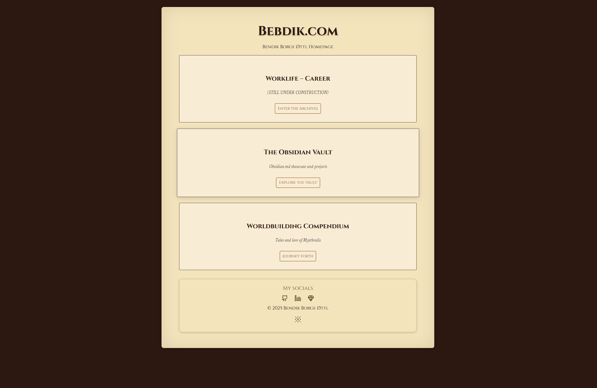

# Bebdik.com (Astro Site)

This repository contains the source code, history, and deployment configuration for my personal website [**bebdik.com**](https://www.bebdik.com), built using [Astro](https://astro.build/).

Please keep in mind that AI has been used to clean up text, and also fixing config files for Astro components. This was mainly intended as a project for brushing up on webdev skills, as well as learning how to use git comfortably. 

Don't take any of the content too seriously. A lot is nerdy worldbuidling, and the rest is mostly ramblings as a creative outlet. 

---

## Live Site

Visit the site at:  
[https://www.bebdik.com](https://www.bebdik.com)

## Site Previews

### Desktop View

---

## Development

All active development happens in the `astro-dev` branch.

## Tech Stack

| Tool / Technology                 | Purpose                                                        |
| --------------------------------- | -------------------------------------------------------------- |
| [**Astro**](https://astro.build/) | Static site builder with a modern component-based architecture |
| **Markdown**                      | Content authoring in a simple, portable format                 |
| **JavaScript / HTML / CSS**       | Light scripting and customization                              |
| **GitHub Pages**                  | Hosting via static site deployment                             |
| **GitHub Actions**                | CI/CD pipeline for automatic deployment                        |
| **Node.js**                       | Runtime for building and developing the site                   |
| [**npm**](https://www.npmjs.com/) | Package management and script running                          |
| **Custom Domain**                 | `www.bebdik.com` — linked to GitHub Pages                      |

## To-Do List

 
<strong> Site Structure & Content</strong>

 
 Create the Work / Portfolio section

 Add more content to the Obsidian page

 Add more content to the Worldbuilding page

 Rewrite parts of Obsidian content

 
 
<strong> Design & User Experience</strong>

 
 Implement light/dark mode toggle

 Clean up design and layout for mobile devices

 Refine typography and spacing on smaller screens

 Add favicon and page metadata

